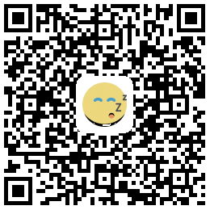
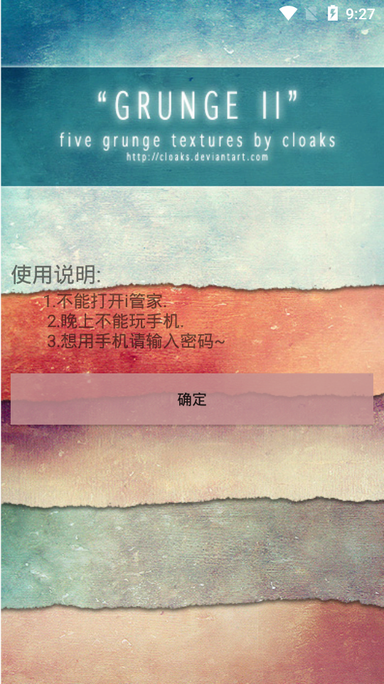
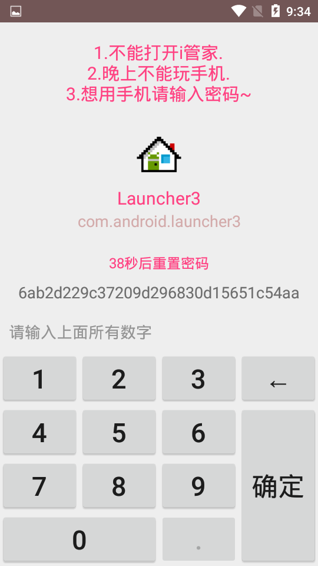

# Forced2Sleep
强制睡觉(forced to sleep) for vivo x6

晚上老是想玩手机,这个也许有一点点用...(我的手机是vivo x6)
<ol>
<li>晚上22:00及以后禁止使用手机(No use phone at night 22:00 and later)</li>
<li>背景图片来自网络,如果侵权请告知,会做及时删除.</li>
<li>logo来自<a href="https://www.iconfont.cn/search/index?searchType=icon&q=sleep">Iconfont-阿里巴巴矢量图标库<a/></li>
</ol>

## Demo
<a href="https://github.com/actor20170211030627/Forced2Sleep/raw/master/forced2sleep-debug.apk">download apk</a>
<tr/>
</img>

## Screenshot
#### 1.主界面 MainActivity
</img>

### 2.输入密码 enter password
</img>